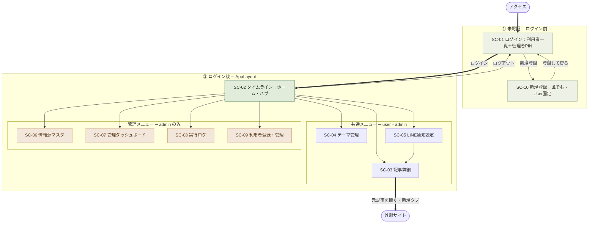

# 画面遷移図 — 情報収集ツール（基本設計）

| 項目 | 内容 |
|---|---|
| 版 | 1.1（フロー整理：ハブ中心＋未認証/共通/管理でグルーピング。HTMLはタブ切替・全幅で図を大きく表示） |
| 作成日 | 2026-08-08 |
| 前工程 | [`01_Requirements/要件定義書.md`](../01_Requirements/要件定義書.md) §5／[`画面設計書.md`](画面設計書.md) |
| 設計ID体系 | 遷移＝`BD-NAV-xx` |

> 各画面の詳細は [`画面設計書.md`](画面設計書.md)。本書は画面間の遷移とロールによる到達可否を示す。

---

## 1. 全体遷移図（Mermaid）

**凡例・読み方**

- **① 未認証**（緑）: ログイン前。`SC-01 ログイン` と `SC-10 新規登録`（誰でも・User固定）だけが使える。
- **② ログイン後**: `SC-02 タイムライン`（緑＝ハブ）を起点に、**共通メニュー**（user/admin）と**管理メニュー**（admin のみ・橙）へ分岐。
- **太線** `==>` は主要な流れ（アクセス→ログイン→ホーム、記事→外部サイト）。
- ハブから各画面への矢印は **AppLayout のドロワーによる遷移**で、実際は**双方向**（各画面からドロワーでハブや他画面へ戻れる）。図では見やすさのため片方向で示す。**正確な向き・契機は下の §2 遷移一覧**を参照。
- 管理メニュー（SC-06〜09）は **admin ログイン時のみ表示**され、user はメニュー非表示＋到達拒否（BD-SC-00-06）。

---

## 2. 遷移一覧

| 遷移ID | From | To | 契機 | ロール条件 |
|---|---|---|---|---|
| BD-NAV-01 | SC-01 | SC-02 | 一般利用者を選択（クレデンシャルなし） | user |
| BD-NAV-02 | SC-01 | SC-02 | 管理者を選択→4桁PIN一致 | admin |
| BD-NAV-03 | SC-01 | SC-01 | PIN不一致（5回でロック・数分） | admin |
| BD-NAV-04 | SC-02 | SC-03 | 記事カードのタイトルをクリック（開封で既読化） | 共通 |
| BD-NAV-05 | SC-03 | SC-02 | 戻る | 共通 |
| BD-NAV-06 | SC-02 / SC-03 | 外部サイト | 「元記事を開く」（新規タブ） | 共通 |
| BD-NAV-07 | SC-02 | SC-04 | ドロワー「テーマ管理」 | 共通 |
| BD-NAV-08 | SC-02 | SC-05 | ドロワー「LINE通知設定」 | 共通 |
| BD-NAV-09 | SC-05 | SC-03 | ブックマーク記事を開く | 共通 |
| BD-NAV-16 | SC-01 | SC-10 | ログイン画面「新規登録」（PIN不要・誰でも）（Q27） | 未認証 |
| BD-NAV-17 | SC-10 | SC-01 | 登録して「ログイン画面へ戻る」 | 未認証 |
| BD-NAV-11 | SC-02 | SC-06 | ドロワー「情報源マスタ」 | **admin** |
| BD-NAV-12 | SC-02 | SC-07 | ドロワー「管理ダッシュボード」 | **admin** |
| BD-NAV-13 | SC-02 | SC-08 | ドロワー「実行ログ」 | **admin** |
| BD-NAV-10 | SC-02 | SC-09 | ドロワー「利用者管理」（管理者ログイン後・Q28） | **admin** |
| BD-NAV-14 | 任意画面 | SC-01 | ログアウト | 共通 |

> AppLayout のドロワーから各画面へ相互遷移できる（SC-02 を起点に図示したが、実際は共通画面間は相互移動可）。管理系メニュー（BD-NAV-10〜13）は admin のみドロワーに表示し、かつサーバー側（Spring Security）でも到達を拒否する（BD-SC-00-06）。
> **利用者登録・管理（SC-09）は管理者ログイン後にドロワー「管理」グループから利用する**（BD-NAV-10・SC-06〜08 と同列）。ログイン画面（SC-01）には管理入口を置かず、新規登録（SC-10・誰でも）のみとする（Q28）。

---

## 3. ロール別 到達可能画面

| 画面 | user | admin |
|---|---|---|
| SC-01 ログイン | ○（未認証） | ○（未認証） |
| SC-10 新規アカウント登録（誰でも・User固定） | ○（未認証） | ○（未認証） |
| SC-02 タイムライン | ○ | ○ |
| SC-03 記事詳細 | ○ | ○ |
| SC-04 テーマ管理 | ○（自分の分） | ○（自分の分） |
| SC-05 LINE通知設定（お気に入り＋LINE連携） | ○（自分の分） | ○（自分の分） |
| SC-09 利用者登録・管理（ドロワー「管理」） | ✗ | ○ |
| SC-06 情報源マスタ | ✗ | ○ |
| SC-07 管理ダッシュボード | ✗ | ○ |
| SC-08 実行ログ | ✗ | ○ |

> ✗ の画面/ブロックは user には**メニュー非表示＋直接URLアクセスも拒否**（authN/authZ 分離・NFR-02）。
