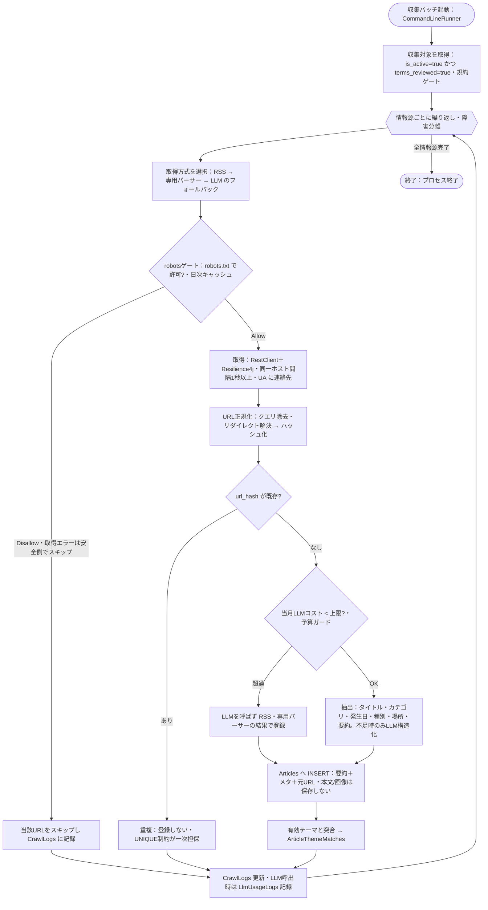
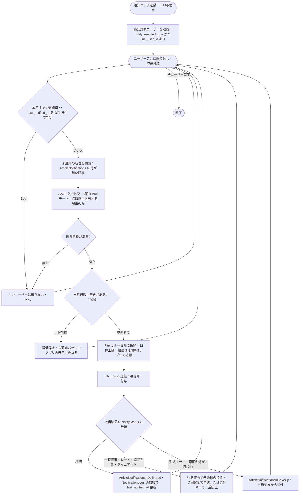

# バッチ設計書 — テーマ別最新情報アグリゲーター（基本設計）

| 項目 | 内容 |
|---|---|
| 版 | 1.0（基本設計・初版） |
| 作成日 | 2026-08-08 |
| 前工程 | [`01_要件定義/要件定義書.md`](../01_要件定義/要件定義書.md) FR-02/FR-03・§8（承認済み v1.8） |
| 関連 | [`テーブル定義書.md`](テーブル定義書.md)／[`外部IF設計書.md`](外部IF設計書.md)／[`メッセージ・エラー一覧.md`](メッセージ・エラー一覧.md) |
| 実行基盤 | Spring Boot 別アプリ＋`CommandLineRunner`（Web と別プロセス・ヘッドレス・実行して終了） |
| 設計ID体系 | 収集＝`BD-BATCH-C-nn`／通知＝`BD-BATCH-N-nn`。要件 `FR-02/03`・`TBL-*` を参照 |

> 本書は**収集バッチ**と**通知バッチ**の処理フロー・入出力・冪等性の担保点・フォールバック・障害分離を確定する。両バッチは**別プロセス**で、**通知は LLM を一切呼ばない**（CLAUDE.md §5）。

---

## 0. 共通方針

| ID | 方針 | 決定内容 | 根拠 |
|---|---|---|---|
| BD-BATCH-00-01 | プロセス分離 | 収集・通知は**別の Spring Boot アプリ**（`CommandLineRunner` でワンショット実行→終了）。Web と別プロセス。常駐しない | NFR-09・§6 Phase |
| BD-BATCH-00-02 | 起動方式 | ローカルは Windows タスクスケジューラ（ログオン時・遅延5分）、VPS は cron / systemd timer（Phase 6）。**定期起動は運用要件**（G1・機能要件ではない）。手動起動は SC-07（FR-06-02） | G1・NFR-12 |
| BD-BATCH-00-03 | 冪等性 | **1日に複数回起動されても重複登録・重複通知しない**。DB 制約（`url_hash` UNIQUE／`ArticleNotifications` PK）を最終防衛線とし、アプリ判定だけに頼らない | NFR-07 |
| BD-BATCH-00-04 | 日時 | すべて UTC（`Instant`）で処理・保存。「同日」判定や月次集計は **JST に変換**して行う（`Asia/Tokyo`・ゾーンIDは一箇所に集約） | NFR-08 |
| BD-BATCH-00-05 | 障害分離 | 1情報源／1利用者の失敗が、他の情報源／利用者の処理を止めない。失敗は握って次へ進み、ログに残す | NFR-10 |
| BD-BATCH-00-06 | ログ | ファイル依存を避け **DB（CrawlLogs／NotificationLogs／LlmUsageLogs）＋標準出力**へ。UTF-8 | §8・§9 |
| BD-BATCH-00-07 | 設定・秘密情報 | 接続文字列・APIキー・LINEトークンは環境変数で注入（`application.yml` はプレースホルダのみ）。リトライ回数・間隔・上限等も外部化 | NFR-11 |
| BD-BATCH-00-08 | 所要時間 | 収集バッチは **15分以内**（NFR-03）。同一ホストへの間隔1秒以上を守りつつ、情報源間は仮想スレッドで並行化してよい | NFR-03・§5 |

### 使用ライブラリ（着手時に最新版・仕様を確認）

| 用途 | ライブラリ |
|---|---|
| HTTP 取得・リトライ | Spring `RestClient` ＋ Resilience4j（リトライ／タイムアウト／サーキットブレーカー） |
| RSS/Atom 解析 | ROME（rome-tools） |
| HTML 解析（専用パーサー） | jsoup |
| robots.txt 解析 | crawler-commons（`SimpleRobotRules`） |
| LLM 構造化 | anthropic-sdk-java（`LlmStructurer` I/F ＋ `LlmBudgetGuard`） |
| LINE 送信 | line-bot-sdk-java |

---

## 1. 収集バッチ（BD-BATCH-C）

### 1.1 目的・入出力

| 区分 | 内容 |
|---|---|
| 目的 | 情報源から最新情報を取得し、**自作要約＋メタ＋元URL**として `Articles` に登録、有効テーマと突合する（FR-02） |
| 入力 | `Sources`（収集対象）／各情報源の RSS・HTML／有効な `Themes`・`ThemeCategories` |
| 出力 | `Articles`（INSERT）／`ArticleThemeMatches`／`CrawlLogs`／`LlmUsageLogs`／`Sources.last_fetched_at` 更新 |
| 呼ぶ外部 | 情報源サイト（GET）／Claude API（**不足時のみ**・予算内のみ） |

### 1.2 処理フロー

### 1.3 ステップ詳細

| ID | ステップ | 内容 | 対応 |
|---|---|---|---|
| BD-BATCH-C-01 | 収集対象抽出 | **規約ゲート**：`is_active=true AND terms_reviewed=true` の情報源のみループ対象。未確認は集めない | FR-02-12 |
| BD-BATCH-C-02 | 取得方式の選択 | `fetch_type` に従い **RSS → 専用パーサー → LLM** の順（コスト・権利・安定性で有利な順） | FR-02-01〜04 |
| BD-BATCH-C-03 | robotsゲート | 取得直前に対象ホストの robots.txt を判定（**日次キャッシュ**）。Disallow はスキップし `CrawlLogs` 記録。取得できない/無い＝許可扱いだが、**取得エラー（タイムアウト等）は安全側で当日スキップ**。`Crawl-delay` があれば従う | FR-02-05 |
| BD-BATCH-C-04 | 取得 | `RestClient`＋Resilience4j（リトライ／タイムアウト／CB）。**同一ホスト間隔1秒以上**、User-Agent に**アプリ名＋連絡先** | FR-02-05・§9 |
| BD-BATCH-C-05 | URL正規化・ハッシュ | クエリ除去・リダイレクト解決後に正規化 → ハッシュ化（同一判定キー） | FR-02-07 |
| BD-BATCH-C-06 | 重複判定（一次） | `url_hash` が既存なら登録しない。**INSERT 時の UNIQUE 制約違反は正常系**として握りつぶす（冪等の最終防衛線） | FR-02-08・NFR-07 |
| BD-BATCH-C-07 | LLM予算ガード | LLM 構造化の**直前**に当月累計コスト（`LlmUsageLogs` 集計・安全マージン込み）を判定。上限到達なら **LLM を呼ばず RSS/パーサー結果で登録**（収集は継続） | FR-02-11・NFR-06 |
| BD-BATCH-C-08 | 抽出・マッピング | タイトル／カテゴリ／発生日（代表日・原文・精度）／**発生日種別**／場所／要約 を抽出。RSS/パーサーで埋まらない項目のみ LLM。**要約は自作**（本文転載しない） | FR-02-06・§9 |
| BD-BATCH-C-09 | 発生日種別の決定 | ①カテゴリ既定 → ②原文キーワード補正 → ③**LLM を呼ぶ記事のみ**出力に種別を含める。**種別のために LLM を新規に呼ばない** | §1 ビジネスルール・EventDateKind |
| BD-BATCH-C-10 | 登録 | `Articles` に INSERT（要約＋メタ＋元URL）。`event_date` が NULL なら整列は `created_at` 代理（式インデックス） | FR-02・SC-02 |
| BD-BATCH-C-11 | 類似グルーピング | 別サイトの同一情報をタイトル類似度＋発生日で束ね `group_key` を付与（Phase 2） | FR-02-09 |
| BD-BATCH-C-12 | テーマ突合 | 収集記事を有効テーマのキーワードと突合し `ArticleThemeMatches` を永続化（複合PKで重複突合防止） | FR-02-10 |
| BD-BATCH-C-13 | ログ記録 | 情報源単位に `CrawlLogs`（件数・新規数・status・エラー）。LLM 呼出は `LlmUsageLogs`（usage×単価で概算コスト） | §8・FR-06-05/06 |
| BD-BATCH-C-14 | 障害分離 | 1情報源で例外→握って `CrawlLogs` に Failed/PartialError を残し次の情報源へ | NFR-10 |

> **フォールバックの意味**: RSS で骨格（タイトル・日付・カテゴリ）が取れれば LLM 不要＝コスト最小。RSS で不足する項目だけ専用パーサー→LLM で補完する。予算ガード（C-07）で上限到達時は LLM を飛ばしても**収集自体は止めない**。

---

## 2. 通知バッチ（BD-BATCH-N）

### 2.1 目的・入出力

| 区分 | 内容 |
|---|---|
| 目的 | お気に入り対象の**未通知の新着**を LINE に1通（Flexカルーセル）で届ける（FR-03）。**LLM 不使用** |
| 入力 | `ArticleNotifications`（未通知判定）／`FavoriteThemes`・`FavoriteSources`（通知ON）／`Users`（notify_enabled・line_user_id・last_notified_at）／`NotificationLogs`（当月通数） |
| 出力 | LINE push（外部）／`ArticleNotifications`（Delivered/GaveUp）／`NotificationLogs`（通数）／`Users.last_notified_at` |
| 呼ぶ外部 | LINE Messaging API（push）のみ |

### 2.2 処理フロー

### 2.3 ステップ詳細

| ID | ステップ | 内容 | 対応 |
|---|---|---|---|
| BD-BATCH-N-01 | 対象ユーザー抽出 | `notify_enabled=true` かつ `line_user_id` 登録済みの利用者のみ | FR-07-03 |
| BD-BATCH-N-02 | 同日2回目の抑止 | `Users.last_notified_at` を **JST 日付**で判定。本日既送なら送らない | FR-03-04・§6 |
| BD-BATCH-N-03 | 未通知抽出 | `ArticleNotifications` に `(user_id, article_id)` 行が**無い**記事＝未通知（未通知フラグ方式） | FR-03-01 |
| BD-BATCH-N-04 | お気に入り絞込 | 通知ON の `FavoriteThemes`／`FavoriteSources` に該当する記事のみ（テーマは `ArticleThemeMatches` 経由、情報源は `Articles.source_id`） | FR-03-02・FR-05-04 |
| BD-BATCH-N-05 | 通数チェック | 当月 `NotificationLogs` の `SUM(message_count)`（JST月）を確認。**上限（200通）到達で送信停止**しアプリ内表示へ切替 | FR-03-05・§6 |
| BD-BATCH-N-06 | カルーセル集約 | 複数記事を**1通**（Flex Message カルーセル）に集約。**バブル上限（おおむね12件・着手時に公式確認）超過は切り詰め**、残りは「他◯件はアプリで確認」（分割送信しない＝無料枠節約） | FR-03-03 |
| BD-BATCH-N-07 | 送信（冪等キー） | LINE push に**冪等キー**（`X-Line-Retry-Key` 相当・着手時に確認）を付与。⑤タイムアウト再送時の二重配信を防ぐ | FR-03-08・NFR-07 |
| BD-BATCH-N-08 | 結果分類 | HTTP ステータス＋例外種別で `NotifyStatus` に分類（§2.4） | FR-03-07・§8.1 |
| BD-BATCH-N-09 | 成功時記録 | `ArticleNotifications` に **Delivered** を INSERT（複合PKで重複通知防止）、`NotificationLogs` に通数、`Users.last_notified_at` を更新 | FR-03-06・NFR-07 |
| BD-BATCH-N-10 | 再送/打ち切り | 再送（①②③⑤）＝**行を作らず未通知のまま**次回起動で再送。打ち切り（④・③の5日超過）＝`ArticleNotifications` に **GaveUp** を記録し再送対象外。GaveUp は SC-02 で「未通知（未達）」表示 | FR-03-07・FR-04-06 |
| BD-BATCH-N-11 | 障害分離 | 1利用者の送信失敗が他利用者の送信を止めない | NFR-10 |

### 2.4 送信失敗の分類・再送（NotifyStatus）

判別は LINE API の HTTP ステータス＋例外種別。常駐しないため「再送」は原則**次回起動時**（同一実行内は Resilience4j による秒単位の短いリトライのみ）。

| 分類 | 判別 | 同一実行内リトライ | 次回起動で再送 | 打ち切り | 記録 |
|---|---|---|---|---|---|
| ①TempError | HTTP 5xx／接続断 | ○（指数バックオフ） | ○ | — | 未通知のまま |
| ②RateLimited | HTTP 429 | ○（`Retry-After` 短ければ従う） | ○ | — | 未通知のまま |
| ③AuthFailed | HTTP 401 | ✗ | ○（トークン修正後） | **5日超過で GaveUp** | 未通知→超過で GaveUp |
| ③Blocked | push では判別困難 | ✗ | ○（友だち追加後） | **5日超過で GaveUp** | 未通知→超過で GaveUp |
| ④FormatError | HTTP 400＋詳細 | ✗ | ✗ | **○ GaveUp（不具合）** | GaveUp |
| ⑤Timeout | 読み取りタイムアウト | ✗ | ○（**冪等キー付き**） | — | 未通知のまま |

> 受信側の安全網: 新着は LINE の成否に関わらず**必ずアプリ内（タイムライン）に入る**。アプリが情報の正。③は SC-05 の LINE連携ステータス＋友だち追加案内で受信側が自己解決。

---

## 3. 冪等性の担保点（バッチ×DB）

| 対象 | 担保 | ステップ |
|---|---|---|
| 記事の重複登録 | `Articles.url_hash` UNIQUE（違反は正常系で握る） | BD-BATCH-C-06 |
| 記事×テーマの重複突合 | `ArticleThemeMatches` 複合PK | BD-BATCH-C-12 |
| 重複通知（再送しない） | `ArticleNotifications` 複合PK（行が在る＝通知済 or 打ち切り） | BD-BATCH-N-09/10 |
| 同日2回目の通知抑止 | `Users.last_notified_at` を JST 日付で判定 | BD-BATCH-N-02 |
| ⑤タイムアウト再送の二重配信防止 | LINE 冪等キー | BD-BATCH-N-07 |

> **未通知＝`ArticleNotifications` に行が無い状態**。送信失敗（①②③⑤）では行を作らず、成功（Delivered）・打ち切り（GaveUp）でのみ行を作る。これにより「複数回起動されても、成功した通知は再送されず、失敗した通知は次回に届く」を DB レベルで保証する。

---

## 4. トレーサビリティ

| 要件 | バッチ設計 |
|---|---|
| FR-02-01〜12（収集） | BD-BATCH-C-01〜14 |
| FR-03-01〜08（通知） | BD-BATCH-N-01〜11 |
| §8.1（LINE失敗分類） | §2.4 |
| NFR-03/06/07/08/10（性能・コスト・冪等・日時・障害分離） | §0・各フロー |
| TBL-Articles/ArticleThemeMatches/ArticleNotifications/NotificationLogs/CrawlLogs/LlmUsageLogs | §1.1・§2.1・§3 |

> 外部API（Claude／LINE）の入出力スキーマ・通数カウント・冪等キーの詳細は [`外部IF設計書.md`](外部IF設計書.md) に、画面表示メッセージは [`メッセージ・エラー一覧.md`](メッセージ・エラー一覧.md) に分離する。
