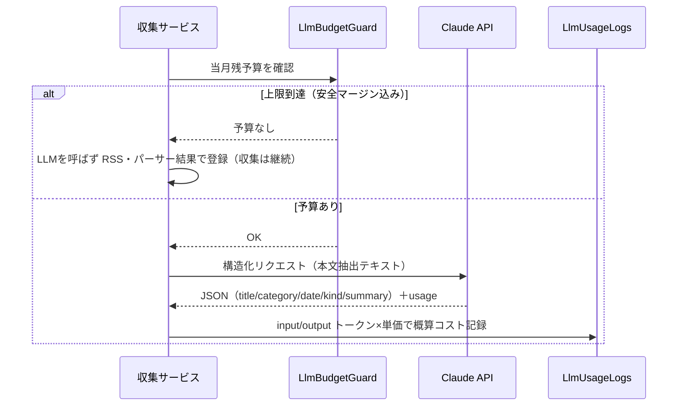
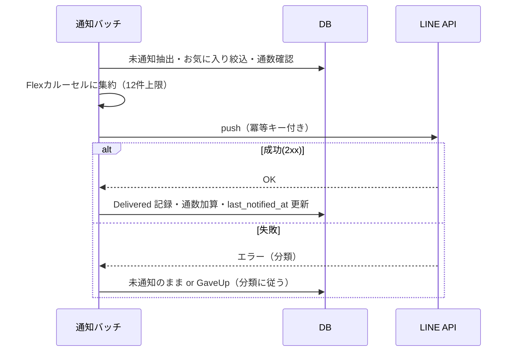

# 外部インターフェース設計書 — テーマ別最新情報アグリゲーター（基本設計）

| 項目 | 内容 |
|---|---|
| 版 | 1.0（基本設計・初版） |
| 作成日 | 2026-08-08 |
| 前工程 | [`01_要件定義/要件定義書.md`](../01_要件定義/要件定義書.md) §7 外部I/F（承認済み v1.8） |
| 関連 | [`バッチ設計書.md`](バッチ設計書.md)／[`テーブル定義書.md`](テーブル定義書.md)／[`メッセージ・エラー一覧.md`](メッセージ・エラー一覧.md) |
| 設計ID体系 | `BD-IF-nn`。要件 `FR-02/03`・`TBL-*`・`NFR-06/11` を参照 |

> 本書は外部システムとの入出力を確定する。**インバウンド**＝収集対象サイト（RSS/HTML）、**アウトバウンド**＝Claude API（収集時の構造化）・LINE Messaging API（通知）。**通知処理では Claude を呼ばない**（CLAUDE.md §5）。バージョン・料金・仕様は改定されうるため**実装着手時に各公式ドキュメントを確認**する（CLAUDE.md §0-4）。

---

## 0. 秘密情報・設定の外部化（全IF共通）

| ID | 方針 | 内容 |
|---|---|---|
| BD-IF-00-01 | 機密の注入 | Claude APIキー／LINE チャネルアクセストークン／DBパスワードは**環境変数のみ**で注入。`application.yml` はプレースホルダ `${...}` のみ、実値をリポジトリに置かない（ローカル＝`.env`（gitignore）、VPS＝systemd `EnvironmentFile`） |
| BD-IF-00-02 | 非機密の環境差分 | User-Agent 連絡先・単価・タイムアウト・リトライ回数・上限値等は Spring Profiles / 設定で外部化 |
| BD-IF-00-03 | 差し替え可能性 | LLM は `LlmStructurer` インターフェースで抽象化し実装をDIで注入（将来のモデル/ベンダ差し替えに備える） |

（根拠: NFR-11・§7.2/7.3・§9）

---

## 1. インバウンド：収集対象（RSS / HTML）

### 1.1 収集方式の優先順位（フォールバック）

| 優先 | 方式 | ライブラリ | LLM | 使いどころ |
|---|---|---|---|---|
| ① | RSS/Atom | ROME（`SyndFeedInput`→`SyndFeed`/`SyndEntry`） | 不使用 | 既定。タイトル・日付・カテゴリが構造化済み |
| ② | 専用パーサー | jsoup（HTML 構造の安定した主要サイト） | 不使用 | RSS で不足する項目の補完 |
| ③ | LLM 構造化 | anthropic-sdk-java（§2） | 使用 | ①②で埋まらない項目のみ・予算内のみ |

HTTP 取得は Spring `RestClient`＋Resilience4j。詳細フローは [`バッチ設計書.md`](バッチ設計書.md) §1。

### 1.2 収集対象（第一陣シード）

| 情報源 | 取得方式 | RSS URL（着手時に実地確認） | 主なカバー |
|---|---|---|---|
| MANTANWEB | RSS | `https://mantan-web.jp/rss/mantan.xml`（要確認） | アニメ/漫画/ゲーム/ラノベ |
| HOBBY Watch | RSS | インプレス系（着手時に特定） | フィギュア/グッズ/プライズ |
| Gamer | RSS | 着手時に特定（運営イード） | アーケード/ゲーセン/イベント |
| 電撃ホビーウェブ | RSS | `hobby.dengeki.com`（着手時に特定・`/tag/gatya/`） | カプセルトイ/フィギュア |

> **検証注記**: 本要件定義時点では環境ポリシーにより RSS の生死・robots.txt・利用規約を実地検証できていない。**Phase 1/2 着手時に実地確認**し、規約OKで `Sources.terms_reviewed=true` を立てるまで収集されない（規約ゲート・FR-02-12）。

### 1.3 収集マナー（遵守事項）

| ID | 項目 | 内容 |
|---|---|---|
| BD-IF-01-01 | robots.txt | 取得直前に判定（**日次キャッシュ**）。Disallow はスキップ。取得エラーは安全側で当日スキップ。crawler-commons `SimpleRobotRules` を使用（自前実装しない） |
| BD-IF-01-02 | アクセス間隔 | **同一ホストへ1秒以上**間隔。`Crawl-delay` があれば従う |
| BD-IF-01-03 | User-Agent | **アプリ名＋連絡先**（メール等）を明記 |
| BD-IF-01-04 | 権利配慮 | 本文・公式画像を保存/表示しない。**自作要約＋メタ＋元URL**のみ。スクレイピング禁止サイトは除外 |

### 1.4 取得データ → 内部項目マッピング

| 内部項目（Articles） | RSS（SyndEntry） | 補完（パーサー/LLM） |
|---|---|---|
| title | `getTitle()` | — |
| url | `getLink()` | — |
| created_at | `getPublishedDate()`（無ければ取得時刻） | — |
| summary | `getDescription()` を**自作要約**に加工 | LLM |
| category | `getCategories()` があれば参照 | ②/③ で分類 |
| event_date / _text / _precision / _kind | 原文から抽出 | ②/③（種別は §BD-BATCH-C-09 の3段判定） |
| location | — | ②/③（イベント時） |

---

## 2. アウトバウンド：Claude API（収集時の構造化のみ）

### 2.1 概要

| 項目 | 内容 |
|---|---|
| 目的 | RSS/パーサーで埋まらない項目を構造化（FR-02-03） |
| 使用モデル | **Claude Sonnet**（正確なモデルID・単価・リクエスト形式は着手時に公式確認） |
| SDK | anthropic-sdk-java（公式）。`LlmStructurer` I/F でDI注入（BD-IF-00-03） |
| 呼び出し条件 | ①②で不足 **かつ** 予算内（`LlmBudgetGuard`）。**通知処理では呼ばない** |
| コスト | 各レスポンスの `usage`（input/output トークン）× モデル単価で自前計算し `LlmUsageLogs` に記録（案A） |

### 2.2 入出力スキーマ

**入力**: 本文抽出テキスト（＋ページのタイトル/URL）。JSON 構造化での応答を要求（JSON以外の付随文を出さない指示）。

**出力（JSON）**:

| フィールド | 型 | 対応（Articles） | 備考 |
|---|---|---|---|
| `title` | string | title | |
| `category` | enum(Category) | category | 1..7,9 のいずれか |
| `event_date` | date \| null | event_date | 代表日 |
| `event_date_text` | string \| null | event_date_text | 原文（「9月上旬」等） |
| `event_date_precision` | enum(EventDatePrecision) | event_date_precision | Exact/Month/Season/Ongoing/Unknown |
| `event_date_kind` | enum(EventDateKind) | event_date_kind | カテゴリ既定/原文で決まる場合は**それを優先**しLLMは補助 |
| `location` | string \| null | location | イベント時 |
| `summary` | string | summary | **自作要約**（本文転載しない・§9） |

> 出力 enum は内部コード値（`AttributeConverter`）に変換して保存（テーブル定義書 §0）。不正・欠損は当該記事をスキップしログに残す（バッチ全体は止めない・§8）。

### 2.3 予算ガードとコスト記録（NFR-06 ハードキャップ）

| ID | 内容 |
|---|---|
| BD-IF-02-01 | 呼び出し**前**に `LlmBudgetGuard` が当月累計（`LlmUsageLogs` の JST 月集計）を確認。上限（例: 500円の90%）到達で **LLM を呼ばずスキップ** |
| BD-IF-02-02 | 呼び出し**後**に `usage` × **記録時点の確定単価**で概算コストを算出し `est_cost_micro_jpy`（マイクロ円）で保存（後日の単価改定で過去実績がぶれない） |
| BD-IF-02-03 | 上限到達状態・当月累計・残予算は SC-07 管理ダッシュボードで可視化（FR-06-06） |

---

## 3. アウトバウンド：LINE Messaging API（通知）

### 3.1 概要

| 項目 | 内容 |
|---|---|
| 方式 | **push**（友だち追加済みユーザーへ）。複数記事を **Flex Message カルーセル**で1吹き出しに集約 |
| SDK | line-bot-sdk-java（公式） |
| 認証 | チャネルアクセストークンは環境変数で注入（BD-IF-00-01）。`application.yml` はプレースホルダのみ |
| 無料枠 | コミュニケーションプラン **月200通**前提。※LINE Notify は 2025-03-31 終了済のため使わない |
| 制約 | **通知では LLM を呼ばない**（要約は収集時に生成済み） |

### 3.2 通数カウント（無料枠管理）

| ID | 内容 |
|---|---|
| BD-IF-03-01 | 通数 ＝ **送信先ユーザー数 × 吹き出し数**。カルーセルで**1通に集約**し吹き出しを1に抑える |
| BD-IF-03-02 | カルーセルのバブル**上限（おおむね12件・着手時に公式確認）超過は切り詰め**、残りは「他◯件はアプリで確認」（分割送信しない） |
| BD-IF-03-03 | 送信ごとに `NotificationLogs`（`message_count`）へ記録。当月 `SUM`（JST月）が上限接近で**送信停止しアプリ内表示へ**（FR-03-05） |

### 3.3 冪等キーと再送（二重配信防止）

| ID | 内容 |
|---|---|
| BD-IF-03-04 | push に**冪等キー**（`X-Line-Retry-Key` 相当・着手時に公式確認）を付与。⑤タイムアウト等「届いたか不明」な再送での二重配信を防ぐ（FR-03-08・NFR-07） |
| BD-IF-03-05 | 冪等キーは「利用者×通知バッチ実行×対象記事集合」で一意に決まる値にし、同じ通知の再送で同一キーになるようにする |

### 3.4 送信結果 → NotifyStatus マッピング

| HTTP / 事象 | NotifyStatus | 処理 |
|---|---|---|
| 2xx | 0:Success | `ArticleNotifications=Delivered`・通数加算・`last_notified_at` 更新 |
| 5xx / 接続断 | 1:TempError | 同一実行内リトライ→ダメなら未通知のまま次回起動 |
| 429 | 2:RateLimited | `Retry-After` が短ければ従う。長ければ待たず次回 |
| 401 | 3:AuthFailed | 自動リトライせず未通知。トークン修正後の次回に届く。**5日超過で GaveUp** |
| （push で判別困難） | 3:Blocked | 未追加/ブロックの可能性。友だち追加後に届く。**5日超過で GaveUp** |
| 400＋詳細 | 5:FormatError | **打ち切り（GaveUp）**。同形式では必ず失敗＝不具合 |
| 読み取りタイムアウト | 6:Timeout | **冪等キー付きで再送**（二重防止） |
| 打ち切り確定 | 9:GaveUp | `ArticleNotifications=GaveUp`・再送対象外・SC-02 で未通知表示 |

> 管理者向けの分類別メッセージは [`メッセージ・エラー一覧.md`](メッセージ・エラー一覧.md)。受信側がアクションを要するのは③のみで、SC-05 の LINE連携ステータス＋友だち追加案内で自己解決（FR-07-03）。

### 3.5 送信シーケンス（要点）

---

## 4. トレーサビリティ

| 要件 | 本書 |
|---|---|
| §7.1 収集対象・収集マナー | §1 |
| §7.2 Claude API（構造化・コスト） | §2 |
| §7.3 LINE Messaging API（push/カルーセル/通数） | §3 |
| FR-02-03/11・NFR-06（LLM・ハードキャップ） | §2.1/2.3 |
| FR-03-03/05/07/08（カルーセル/通数/失敗/冪等キー） | §3.2/3.3/3.4 |
| NFR-11（秘密情報の外部化） | §0 |

> 収集・通知の内部処理フローは [`バッチ設計書.md`](バッチ設計書.md)、DB定義は [`テーブル定義書.md`](テーブル定義書.md)、文言は [`メッセージ・エラー一覧.md`](メッセージ・エラー一覧.md)。
