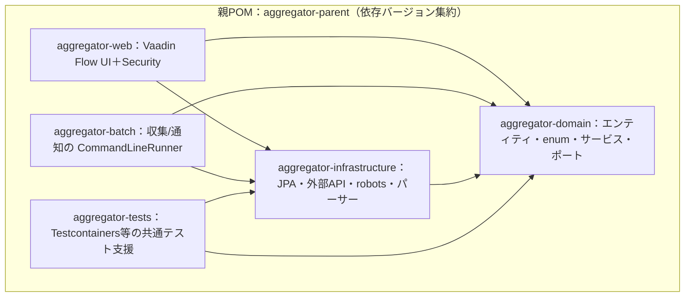

# アーキテクチャ設計書 — 情報収集ツール（詳細設計）

| 項目 | 内容 |
|---|---|
| 版 | 1.0（詳細設計・初版） |
| 作成日 | 2026-08-08 |
| 前工程 | `02_BasicDesign/` 一式（承認済み）／[`01_Requirements/要件定義書.md`](../01_Requirements/要件定義書.md) §4 技術構成 |
| 関連 | [`クラス設計書.md`](クラス設計書.md)／[`DI設計書.md`](DI設計書.md)／[`データアクセス設計書.md`](データアクセス設計書.md) |
| 設計ID体系 | `DD-ARC-nn`。基本設計 `BD-*`・要件 `FR/NFR` を参照 |

> 本書は Maven マルチモジュール構成と層の依存方向を確定する。**Java 実務未経験の開発者向けに、なぜこう分けるのかを明記**する（CLAUDE.md §2）。DB=PostgreSQL、UI=Vaadin Flow、バッチ=Spring Boot 別アプリ。

---

## 1. モジュール構成（Maven マルチモジュール）

| モジュール | 責務 | 主な依存 | 対応 |
|---|---|---|---|
| **domain**（DD-ARC-01） | エンティティ・enum・値オブジェクト・**アプリケーションサービス**・外部依存の**ポート（interface）**・業務ルール（URL正規化・発生日種別判定） | フレームワーク非依存を基本（JPA注釈は許容） | 全FR |
| **infrastructure**（DD-ARC-02） | ポートの**実装**：Spring Data JPA リポジトリ、`RestClient`/HttpClient クライアント（Claude/LINE/HTTP取得）、ROME アダプタ（RSS取得）、jsoup アダプタ（**LLM補完用の本文抽出のみ**・専用パーサー取得は不採用）、robots(crawler-commons)、`AttributeConverter` | domain | FR-02/03・§6 |
| **web**（DD-ARC-03） | Vaadin Flow の画面（SC-01〜10）、認証・認可、表示用DTOとJST変換 | domain・infrastructure | SC-* |
| **batch**（DD-ARC-04） | 収集アプリ・通知アプリ（各 `main` ＋ `CommandLineRunner`）。Web と別プロセス | domain・infrastructure | FR-02/03・BD-BATCH |
| **tests**（DD-ARC-05） | Testcontainers（本物のPostgreSQL）・共通フィクスチャ・モック支援 | domain・infrastructure | 単体/結合テスト工程 |

> **【実装状況】** 現在の Maven モジュールは **domain / infrastructure / web / batch の4つ**で、**`aggregator-tests`（DD-ARC-05）は未作成**、**Testcontainers も未導入**である。単体テストは各モジュールの `src/test` に JUnit 5 + Mockito で配置しており、実DBを起動する結合検証は結合テスト工程（`06_IntegrationTest/`・未着手）に持ち越している。
> また **web（DD-ARC-03）の認可は Spring Security ではなく自前実装**である。Vaadin の `VaadinServiceInitListener` を用いた `AuthGuard` が全画面遷移前に割り込み、未ログインの差し戻しと `AdminOnly` 画面の到達拒否を行う。`spring-security-crypto` は依存に含むが、用途は**管理者PINの BCrypt ハッシュのみ**で、`SecurityFilterChain` や `@PreAuthorize` は使用していない。

### なぜ層（モジュール）を分けるのか（DD-ARC-06）

- **依存を一方向に固定**して「ビジネスの中心（domain）が、DBや外部API（infrastructure）や画面（web）に引きずられない」ようにする。domain は infrastructure を知らず、**ポート（interface）**だけを見る。実装は infrastructure 側に置き、Spring の DI で差し込む（依存性逆転）。
- **利点**: ①テスト容易（domain をモックのポートで単体テストできる＝テスト工程の前提）②差し替え容易（LLM を Claude 以外へ、DB を別RDBへ、が局所修正で済む）③**収集/通知/Webが同じ domain を共有**しつつ別プロセスで動かせる（NFR-09 移行性・BD-BATCH-00-01）。
- Delphi のユニット分割＋インターフェース参照に近い。違いは「Spring コンテナが実装を注入する」点で、`new` で具象を掴まない（§DI設計書）。

---

## 2. 実行単位（デプロイ単位）

| 実行単位 | エントリポイント | 常駐 | 対応 |
|---|---|---|---|
| Web アプリ（DD-ARC-07） | `WebApplication`（`@SpringBootApplication`・組込サーバ） | 常駐（localhost） | SC-* |
| 収集バッチ（DD-ARC-08） | `CollectionBatchApplication` ＋ `CollectionRunner implements CommandLineRunner` | ワンショット（実行→終了） | FR-02 |
| 通知バッチ（DD-ARC-09） | `NotificationBatchApplication` ＋ `NotificationRunner implements CommandLineRunner` | ワンショット | FR-03 |

> **なぜ Web とバッチを別プロセスにするか（DD-ARC-10）**: バッチは「起動して処理して終了」する性質で、常駐する Web と混ぜると障害の巻き込み・スケジューリングの複雑化を招く。別 `main` にすれば、タスクスケジューラ/cron からバッチだけを叩け、VPS 移行後も同じ構造で回る（BD-BATCH-00-01/02・G1）。3アプリは**同一コードベース（同じ domain/infrastructure）**を共有し、`spring.profiles`／起動クラスだけが異なる。

---

## 3. パッケージ方針（DD-ARC-11）

- ルート: `com.example.aggregator`（実際の groupId は着手時に決定）。
- domain: `domain.model`（エンティティ/enum）・`domain.service`（アプリサービス）・`domain.port`（外部依存の interface）・`domain.rule`（URL正規化・種別判定）。
- infrastructure: `infra.persistence`（JPA）・`infra.web`（RestClient クライアント）・`infra.rss`・`infra.robots`・`infra.llm`・`infra.line`。
- web: `web.view`（Vaadin）・`web.security`・`web.dto`。
- batch: `batch.collection`・`batch.notification`。

---

## 4. 技術選定の要点（CLAUDE.md §4 準拠・DD-ARC-12）

| 層 | 選定 | 詳細設計での扱い |
|---|---|---|
| 言語/基盤 | Java 21 / Spring Boot 3.x | 仮想スレッドで収集を並行化（§例外・リトライ／シーケンス） |
| ビルド | Maven マルチモジュール | 本書 §1 |
| ORM | Spring Data JPA + Hibernate | データアクセス設計書 |
| マイグレーション | Flyway（`V1__*.sql`） | データアクセス設計書 |
| HTTP | `RestClient` + Resilience4j | 例外・リトライ設計書 |
| RSS取得/本文抽出/robots | ROME / jsoup（本文抽出のみ） / crawler-commons | infrastructure アダプタ（取得方式はRSSのみ・専用パーサー不採用） |
| LLM/通知 | anthropic-sdk-java / line-bot-sdk-java | ポート＋実装で抽象化 |
| 設定/秘密 | `application.yml`＋環境変数/`.env` | 設定・秘密情報設計書 |

---

## 5. トレーサビリティ

| 基本設計 | 本書 |
|---|---|
| BD-BATCH-00-01（プロセス分離） | DD-ARC-04・07〜10 |
| §6 データ設計・BD-IF-00-03（差し替え可能性） | DD-ARC-01/02・06 |
| NFR-09（移行性） | DD-ARC-06・10 |

> 各モジュール内の具体クラスは [`クラス設計書.md`](クラス設計書.md)、依存の注入方法は [`DI設計書.md`](DI設計書.md)。
