# クラス設計書 — テーマ別最新情報アグリゲーター（詳細設計）

| 項目 | 内容 |
|---|---|
| 版 | 1.0（詳細設計・初版） |
| 作成日 | 2026-08-08 |
| 前工程 | [`アーキテクチャ設計書.md`](アーキテクチャ設計書.md)／`02_BasicDesign/`（承認済み） |
| 関連 | [`シーケンス設計書.md`](シーケンス設計書.md)／[`データアクセス設計書.md`](データアクセス設計書.md)／[`DI設計書.md`](DI設計書.md) |
| 設計ID体系 | `DD-CLS-nn`。基本設計 `BD-*`・要件 `FR-*` を参照 |

> 主要クラスの**責務・シグネチャ・インターフェース境界**を確定する。**ポート（interface）は domain、実装は infrastructure**（依存性逆転）。Java 固有の書き方には理由を添える。

---

## 1. ドメイン中核（収集）クラス図

```mermaid
classDiagram
    class CollectionService {
        +run() CollectionResult
        -collectFrom(Source) SourceResult
    }
    class LlmBudgetGuard {
        +hasBudget() boolean
        +recordUsage(LlmUsage) void
    }
    class EventDateKindResolver {
        +resolve(Category, String) EventDateKind
    }
    class UrlNormalizer {
        +normalize(String) String
    }
    class UrlHasher {
        +hash(String) String
    }

    class FeedFetcher {
        <<interface>>
        +fetch(Source) List~RawItem~
    }
    class ArticleContentExtractor {
        <<interface>>
        +extract(String url) Optional~String~
    }
    class LlmStructurer {
        <<interface>>
        +structure(ExtractedText) StructuredArticle
    }
    class RobotsGate {
        <<interface>>
        +isAllowed(String url) boolean
    }
    class ArticleRepository {
        <<interface>>
        +existsByUrlHash(String) boolean
        +save(Article) Article
    }
    class ThemeMatcher {
        +match(Article, List~Theme~) List~ArticleThemeMatch~
    }

    CollectionService --> FeedFetcher
    CollectionService --> ArticleContentExtractor
    CollectionService --> LlmStructurer
    CollectionService --> RobotsGate
    CollectionService --> ArticleRepository
    CollectionService --> LlmBudgetGuard
    CollectionService --> EventDateKindResolver
    CollectionService --> UrlNormalizer
    CollectionService --> UrlHasher
    CollectionService --> ThemeMatcher
```

> `<<interface>>` はポート。`CollectionService` は**具象を知らず interface だけに依存**し、実装（ROME/Claude/crawler-commons/JPA）は DI で注入される（差し替え・テスト容易）。取得方式は RSS のみ（専用パーサーは廃止）。`ArticleContentExtractor` は **LLM 補完に渡す本文テキスト抽出**の用途で jsoup を使う（HTMLスクレイピング取得ではない）。

---

## 2. ドメインサービス（domain.service）

| クラス | 責務 | 主メソッド（シグネチャ） | 対応 |
|---|---|---|---|
| `CollectionService`（DD-CLS-01） | 収集全体の制御・障害分離・冪等 | `CollectionResult run()` | FR-02・BD-BATCH-C |
| `NotificationService`（DD-CLS-02） | 未通知抽出→絞込→カルーセル→送信→結果記録 | `NotificationResult run()` | FR-03・BD-BATCH-N |
| `LlmBudgetGuard`（DD-CLS-03） | 当月コスト判定・usage記録 | `boolean hasBudget()` / `void recordUsage(LlmUsage u)` | FR-02-11・NFR-06 |
| `TimelineQueryService`（DD-CLS-04） | 一覧の並び替え・フィルタ・検索・ページング | `Page<TimelineItem> query(TimelineCriteria c, Pageable p)` | FR-04・SC-02 |
| `ThemeService`（DD-CLS-05） | テーマCRUD・重複チェック | `Theme create(UserId, ThemeForm)` ほか | FR-01・SC-04 |
| `FavoriteService`（DD-CLS-06） | お気に入り/通知ON・ブックマーク | `void toggleThemeFavorite(...)` ほか | FR-05・SC-05 |
| `UserService`（DD-CLS-07） | 自己登録(User固定)・管理(admin)・PIN照合/ロック | `User selfRegister(String name)` / `boolean verifyPin(...)` | FR-07・SC-01/09/10 |
| `SourceService`（DD-CLS-08） | 情報源マスタ・規約ゲート更新 | `void markTermsReviewed(SourceId)` ほか | FR-06-01・SC-06 |
| `CostService`（DD-CLS-09） | 当月LLMコスト/残予算の算出（表示用） | `CostSummary currentMonth()` | FR-06-06・SC-07 |
| `NotificationCountService`（DD-CLS-10） | 当月通数の集計/残量 | `MessageQuota currentMonth()` | FR-03-05・SC-07 |

> **なぜサービスに集約するか（DD-CLS-11）**: 業務手順（トランザクション境界・冪等判定・分離）を1箇所に置くと、Web・バッチのどちらから呼んでも同じ振る舞いになる。Vaadin の画面クラスやバッチの Runner には「業務ロジックを書かない」（薄く保つ）。

---

## 3. ポート（domain.port・interface）と実装（infrastructure）

| ポート（domain） | 実装（infrastructure） | ライブラリ | 対応 |
|---|---|---|---|
| `FeedFetcher`（DD-CLS-12） | `RomeFeedFetcher` | ROME | FR-02-01 |
| `HtmlParser`（DD-CLS-13・**廃止**） | `JsoupHtmlParser`（廃止） | — | FR-02-02（不採用） |
| `ArticleContentExtractor`（DD-CLS-13） | `JsoupArticleContentExtractor` | jsoup | FR-02-03（LLM補完用の本文抽出） |
| `HttpContentFetcher`（DD-CLS-14） | `RestClientHttpFetcher`／JDK HttpClient | RestClient/HttpClient＋Resilience4j | FR-02-05 |
| `RobotsGate`（DD-CLS-15） | `CrawlerCommonsRobotsGate`（日次キャッシュ） | crawler-commons | FR-02-05 |
| `LlmStructurer`（DD-CLS-16） | `ClaudeLlmStructurer` | anthropic-sdk-java | FR-02-03 |
| `LineNotifier`（DD-CLS-17） | `LineBotNotifier`（冪等キー付与） | line-bot-sdk-java | FR-03-03/08 |
| `*Repository`（DD-CLS-18） | Spring Data JPA インターフェース | Spring Data JPA | §6・データアクセス設計書 |
| `TimeProvider`（DD-CLS-19） | `SystemTimeProvider`（`Instant.now()`） | — | NFR-08・テスト容易性 |

> **`TimeProvider` を挟む理由**: `Instant.now()` を直接呼ぶとテストで時刻を固定できない。ポート化して固定時刻のテストダブルを注入できるようにする（「同日2回目抑止」等の時刻依存ロジックを検証するため）。

---

## 4. ドメインルール（domain.rule・状態を持たない純粋関数的クラス）

| クラス | 責務 | 対応 |
|---|---|---|
| `UrlNormalizer`（DD-CLS-20） | クエリ除去・リダイレクト解決後の正規化 | FR-02-07 |
| `UrlHasher`（DD-CLS-21） | 正規化URL→ハッシュ（SHA-256等） | FR-02-07/08 |
| `EventDateKindResolver`（DD-CLS-22） | ①カテゴリ既定→②原文キーワードで種別決定（③LLMは出力を優先採用） | FR-02-06・§1 |
| `SummaryPolicy`（DD-CLS-23） | 本文を保存せず自作要約に整える方針の適用 | §9 |
| `JstFormatter`（DD-CLS-24） | `Instant`→JST 表示（`ZoneId.of("Asia/Tokyo")` を集約） | NFR-08 |

> これらは**副作用なし・状態なし**なので singleton Bean（またはstaticユーティリティ）でよい。DIポリシーは [`DI設計書.md`](DI設計書.md)。

---

## 5. DTO / record（エンティティと分離）

| 型 | 用途 | 備考 |
|---|---|---|
| `RawItem`（DD-CLS-25） | 取得直後の生データ（title/url/pubDate/description/category） | ROME（RSS）の出力を統一 |
| `ExtractedText`（DD-CLS-26） | LLM入力（本文抽出テキスト＋title/url） | FR-02-03 |
| `StructuredArticle`（DD-CLS-27） | LLM出力（§外部IF 2.2 のJSON） | `record`・null は `Optional` 表現 |
| `TimelineItem`（DD-CLS-28） | 一覧表示用DTO（JST整形済み・種別ラベル付き） | SC-02・エンティティを画面に晒さない |
| `NotificationBundle`（DD-CLS-29） | 1利用者への通知対象記事集合＋冪等キー | FR-03-03/08 |
| `CostSummary`/`MessageQuota`（DD-CLS-30） | ダッシュボード表示用 | SC-07 |

> **なぜエンティティと DTO を分けるか（DD-CLS-31）**: JPA エンティティを画面やAPIにそのまま渡すと、遅延ロード・トランザクション外アクセス（`LazyInitializationException`）や不要な項目露出が起きる。表示用は `record` の DTO に詰め替え、JST 変換もここで済ませる（表示層に時刻変換を閉じる・NFR-08）。`record` は不変で equals/hashCode 自動生成のため DTO に最適。

---

## 6. Web（web.view・Vaadin Flow）

| クラス | 画面 | 備考 |
|---|---|---|
| `MainLayout`（DD-CLS-32） | AppLayout（上部バー＋ドロワー） | BD-SC-00-01。ドロワー項目をロールで出し分け |
| `LoginView` / `SignupView`（DD-CLS-33） | SC-01 / SC-10 | 未認証。PINパッド／自己登録(User固定) |
| `TimelineView` / `ArticleDetailView`（DD-CLS-34） | SC-02 / SC-03 | カード型・並び順/フィルタ/検索・新規タブ外部リンク |
| `ThemeView` / `NotificationSettingsView`（DD-CLS-35） | SC-04 / SC-05 | 各自の分。SC-05＝LINE連携＋お気に入り |
| `SourceMasterView` / `AdminDashboardView` / `ExecutionLogView` / `UserAdminView`（DD-CLS-36） | SC-06/07/08/09 | admin 限定 |

> 画面クラスは**サービスを呼ぶだけ**に保つ（DD-CLS-11）。Vaadin はサーバー側 Java でUIを書くステートフルUIのため、画面インスタンスは基本 `UI`（セッション）単位。業務状態はサービス／DBに置き、画面は表示状態のみ持つ。

---

## 7. トレーサビリティ

| 基本設計 | 本書 |
|---|---|
| BD-BATCH-C（収集フロー） | DD-CLS-01・03・12〜16・20〜22 |
| BD-BATCH-N（通知フロー） | DD-CLS-02・10・17・29 |
| SC-01〜10 | DD-CLS-32〜36 |
| BD-IF-00-03（差し替え） | DD-CLS-12〜17（ポート） |
| NFR-08（UTC/JST） | DD-CLS-19・24・28 |

> 具体的な呼び出し順は [`シーケンス設計書.md`](シーケンス設計書.md)、Bean登録は [`DI設計書.md`](DI設計書.md)、永続化詳細は [`データアクセス設計書.md`](データアクセス設計書.md)。
