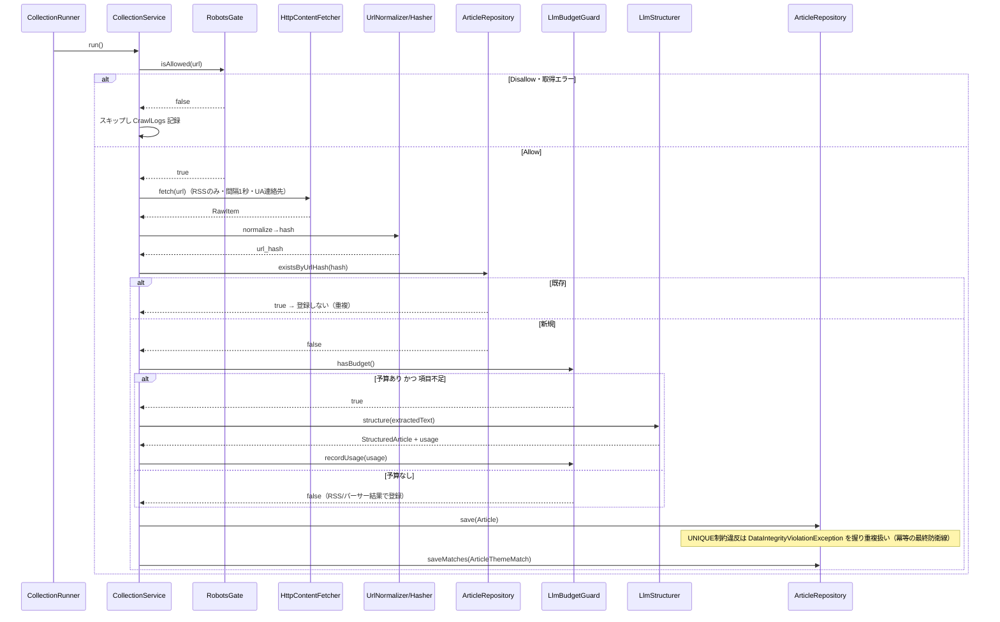
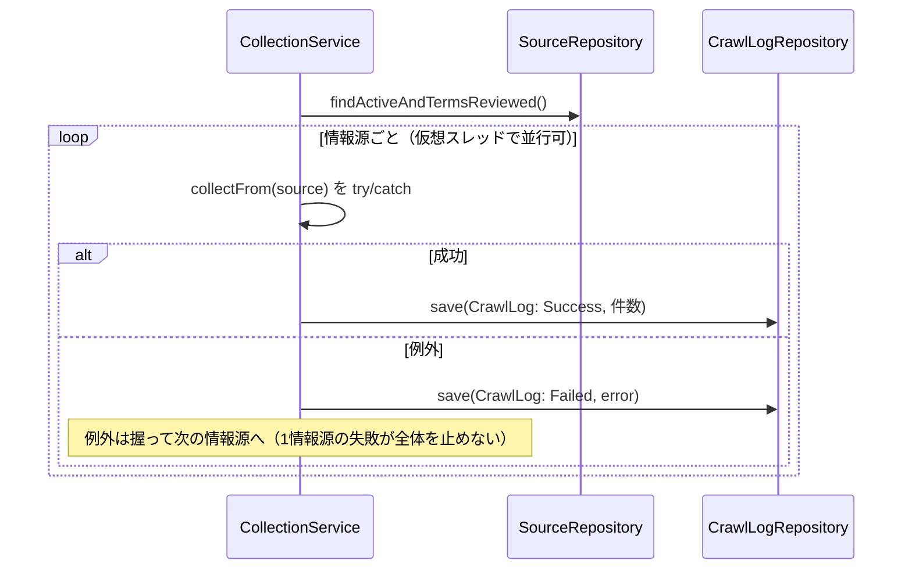
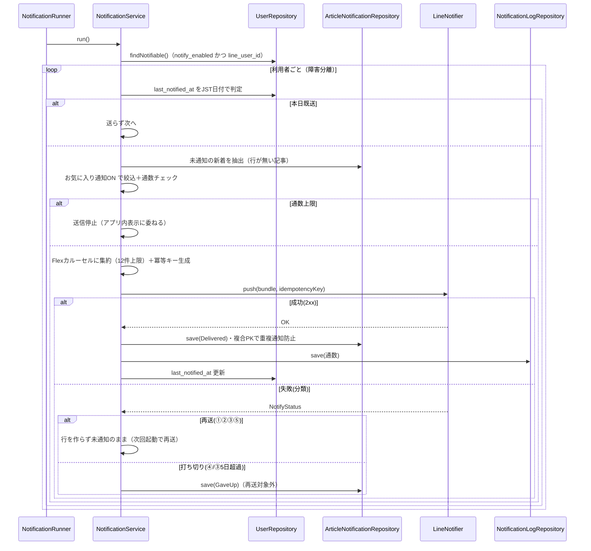
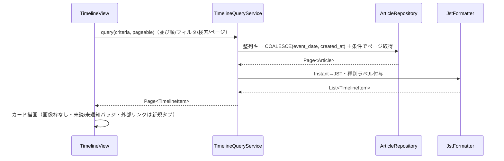

# シーケンス設計書 — 情報収集ツール（詳細設計）

| 項目 | 内容 |
|---|---|
| 版 | 1.0（詳細設計・初版） |
| 作成日 | 2026-08-08 |
| 前工程 | [`クラス設計書.md`](クラス設計書.md)／[`バッチ設計書.md`](../02_BasicDesign/バッチ設計書.md) |
| 設計ID体系 | `DD-SEQ-nn`。クラスは `DD-CLS-*`、基本設計は `BD-BATCH-*` を参照 |

> 主要処理の**呼び出し順序とトランザクション境界・冪等の担保点**を確定する。

---

## 1. 収集：1記事の登録（冪等・RSS取得＋取得後のLLM補完）DD-SEQ-01

要点: 一次判定（`existsByUrlHash`）＋DB制約（UNIQUE）の**二段で冪等**。同時実行や取りこぼしがあっても最終防衛線で重複登録しない（DD-CLS-01/03/12〜22・BD-BATCH-C-06/07）。

---

## 2. 収集：情報源単位の障害分離 DD-SEQ-02

（NFR-10・BD-BATCH-C-01/14。並行化の理由は §5。）

---

## 3. 通知：未通知抽出→送信→結果記録 DD-SEQ-03

要点: **未通知＝`ArticleNotifications` に行が無い**。成功/打ち切りでのみ行を作るため、複数回起動しても成功済みは再送されず失敗は次回届く（NFR-07・BD-BATCH-N・§8.1）。**LLMは一切呼ばない**。

---

## 4. 一覧表示（Web・SC-02）DD-SEQ-04

（NFR-04＝式インデックスで2秒以内。エンティティを画面に晒さず DTO 化・DD-CLS-28/31。）

---

## 5. 並行化の設計判断（仮想スレッド）DD-SEQ-05

- 収集は**I/Oバウンド**（各サイトのHTTP待ちが支配的）。情報源ごとの取得を**Java 21 の仮想スレッド**で並行化すると、少ないコードで待ち時間を重ねられ 15分以内（NFR-03）に収まりやすい。
- **なぜ async/await 相当（CompletableFuture チェーン）を避けるか**: 仮想スレッドなら「1情報源＝1スレッドで上から下に手続き的に書く」ままブロッキング呼び出しでよく、可読性が高い（Delphi の手続き的コードに近い書き味）。`try/catch` の障害分離もそのまま書ける。
- ただし**同一ホストへの間隔1秒以上**（BD-IF-01-02）は守るため、同一ホストのリクエストは直列化（ホスト単位のガード）。DB書き込みはトランザクション境界を短く保つ（§データアクセス設計書）。

---

## 6. トレーサビリティ

| 基本設計 | 本書 |
|---|---|
| BD-BATCH-C-06/07/14 | DD-SEQ-01/02 |
| BD-BATCH-N-02〜10・§8.1 | DD-SEQ-03 |
| SC-02・NFR-04 | DD-SEQ-04 |
| NFR-03/10 | DD-SEQ-02/05 |
