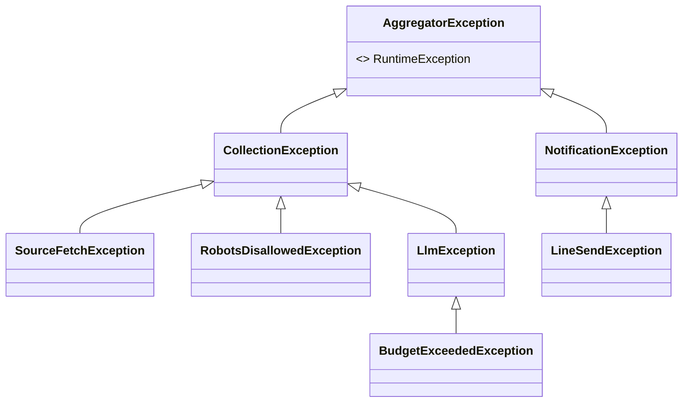

# 例外・リトライ設計書 — 情報収集ツール（詳細設計）

| 項目 | 内容 |
|---|---|
| 版 | 1.0（詳細設計・初版） |
| 作成日 | 2026-08-08 |
| 前工程 | [`バッチ設計書.md`](../02_BasicDesign/バッチ設計書.md) §8.1／[`外部IF設計書.md`](../02_BasicDesign/外部IF設計書.md) §3.4 |
| 設計ID体系 | `DD-EXC-nn` |

> 例外階層・Resilience4j 設定・情報源/利用者単位の失敗分離を実装レベルで確定する。

---

## 1. 例外階層（DD-EXC-01）



| 例外 | 用途 | 既定の扱い |
|---|---|---|
| `AggregatorException`（DD-EXC-02） | 基底（非チェック=RuntimeException） | ログ＋文脈付与 |
| `SourceFetchException` | 取得失敗（HTTP/パース） | 情報源単位で握り継続（CrawlLog=Failed） |
| `RobotsDisallowedException` | robots 不許可・取得エラー | 当該URLスキップ（当日）・情報扱い |
| `LlmException` / `BudgetExceededException` | 構造化失敗 / 予算超過 | 記事スキップ or LLM回避（RSSで登録） |
| `LineSendException` | LINE 送信失敗 | `NotifyStatus` に分類し再送/打ち切り |

> **なぜ非チェック例外（RuntimeException）中心か（DD-EXC-03）**: チェック例外はシグネチャ汚染と過剰な try/catch を招く。業務例外は非チェックにし、**握る場所（ループ境界）を1箇所に決める**方が分離の意図が明確。Spring もトランザクションのロールバック既定は非チェック例外。

---

## 2. Resilience4j（HTTP取得・LINE送信）DD-EXC-04

| 機能 | 対象 | 方針（値は設定で外部化・着手時に調整） |
|---|---|---|
| Retry | HTTP取得・LINE送信 | 数回・**指数バックオフ**。①TempError/②RateLimited（`Retry-After`尊重）に適用。④FormatError/③AuthFailed は**リトライしない** |
| TimeLimiter | 全外部呼び出し | 接続/読み取りタイムアウト。⑤Timeout は「不明」として冪等キー再送へ |
| CircuitBreaker | ホスト/API単位 | 連続失敗で一時オープンし無駄打ちを止める。収集の他情報源はブロックしない |

```java
@Retry(name = "httpFetch")           // 一時障害のみ自動リトライ
@CircuitBreaker(name = "httpFetch")
public RawItem fetch(String url) { ... }
```

> リトライ可否は**分類で出し分ける**（§8.1）。同一実行内で回復しなければ、収集は次回起動、通知は「未通知のまま次回起動で再送」（常駐しないバッチのため“N分後”ではなく次回起動＝BD-BATCH-N-10）。

---

## 3. 失敗分離の実装（ループ境界で握る）DD-EXC-05

```java
for (Source s : activeSources) {          // 情報源単位（NFR-10）
    try {
        collectFrom(s);                    // 例外はここで止める
        crawlLogs.save(success(s));
    } catch (RuntimeException e) {
        crawlLogs.save(failed(s, e));      // ログに残して
        // 次の情報源へ continue（全体は止めない）
    }
}
```

- 通知も同様に**利用者単位**で try/catch（1利用者の失敗が他を止めない・BD-BATCH-N-11）。
- 握る粒度は「情報源/利用者」の1レベルのみ。内側で握り潰さない（原因が消えるのを防ぐ）。

---

## 4. LINE 送信の分類→処理（DD-EXC-06）

| NotifyStatus | 例外/HTTP | リトライ | 次回再送 | 打ち切り |
|---|---|---|---|---|
| ①TempError | 5xx/接続断 | ○ 指数 | ○ | — |
| ②RateLimited | 429 | ○（Retry-After） | ○ | — |
| ③AuthFailed | 401 | ✗ | ○ | 5日超過で GaveUp |
| ③Blocked | 判別困難 | ✗ | ○ | 5日超過で GaveUp |
| ④FormatError | 400 | ✗ | ✗ | GaveUp（不具合） |
| ⑤Timeout | 読取TO | ✗ | ○（冪等キー） | — |

（外部IF設計書 §3.4・メッセージ一覧 §6 と一致。5日判定は最初の失敗時刻からの経過で行い、`ArticleNotifications` 未作成期間で管理。）

---

## 5. ログ方針（DD-EXC-07）

- 失敗は **DB（CrawlLogs/NotificationLogs）＋標準出力**へ。ファイル依存を避ける（NFR-09・§9）。
- 例外ログには**情報源名/URL/利用者ID等の文脈**を必ず付与（原因追跡のため）。秘密情報（トークン/キー）はログに出さない。
- 文字コード UTF-8。ログレベルは Profiles で切替（本番=INFO、開発=DEBUG）。

---

## 6. トレーサビリティ

| 基本設計/要件 | 本書 |
|---|---|
| §8・§8.1（エラー方針・分類） | DD-EXC-01/06 |
| NFR-10（障害分離） | DD-EXC-05 |
| BD-IF-03-04（冪等キー再送） | DD-EXC-04/06 |
| NFR-09/§9（ログ・移行性） | DD-EXC-07 |
