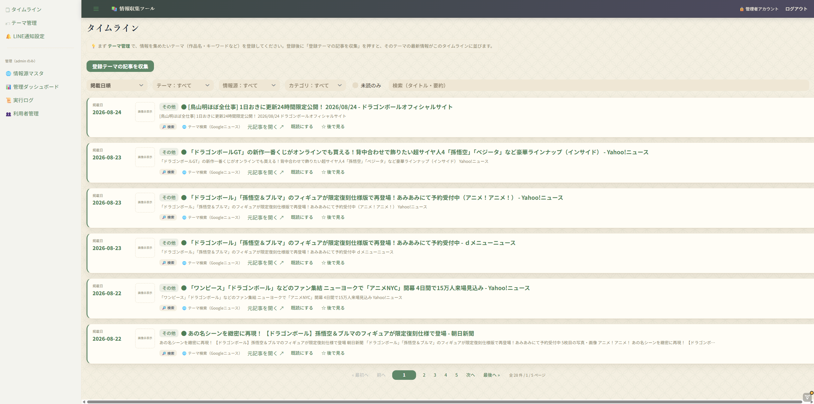
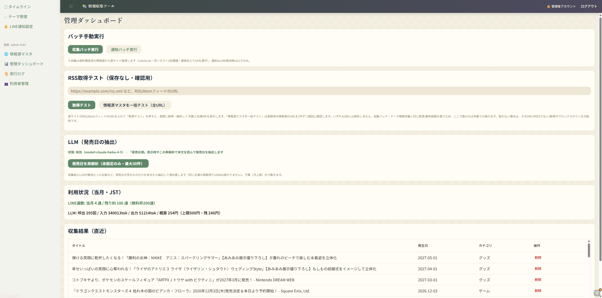
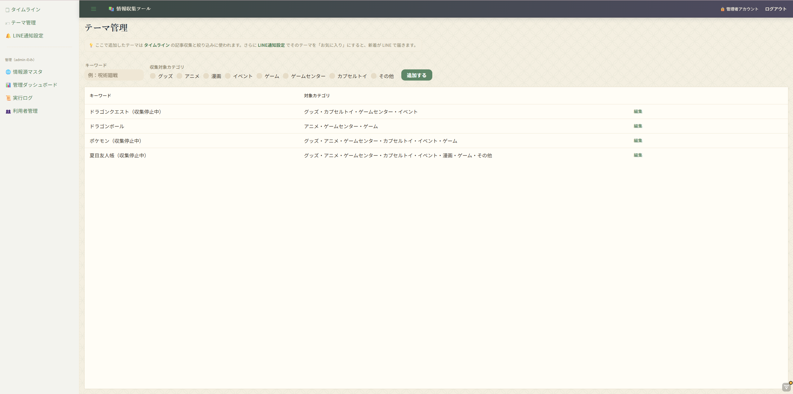
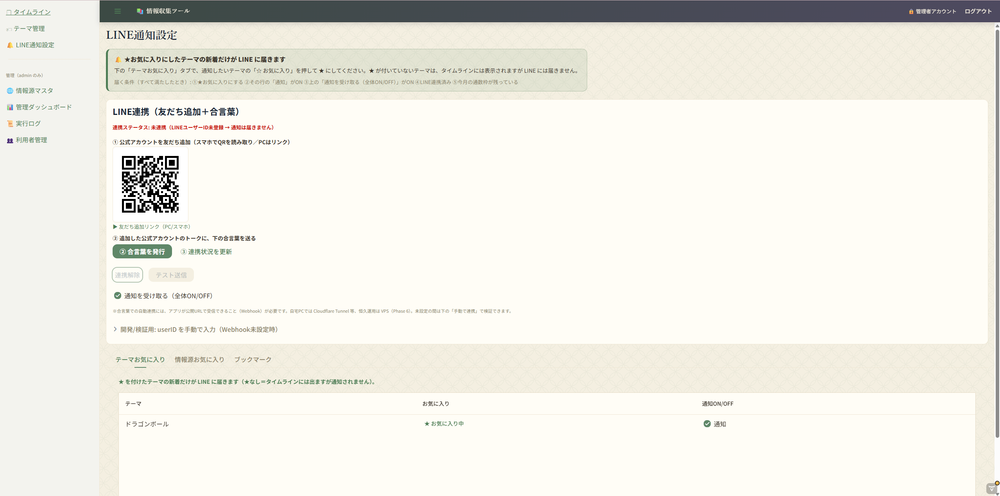
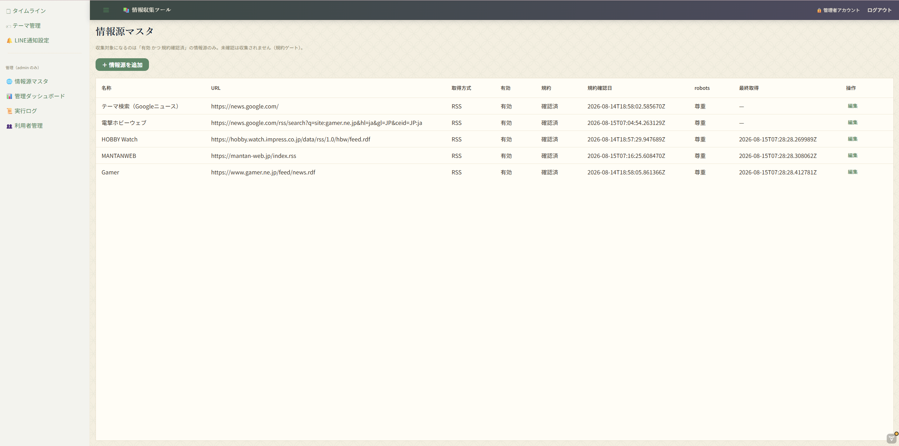
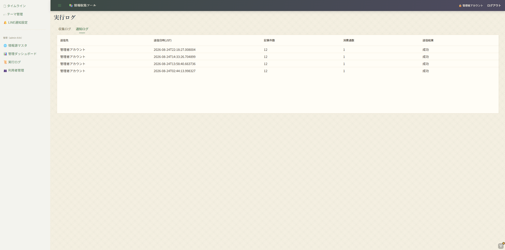
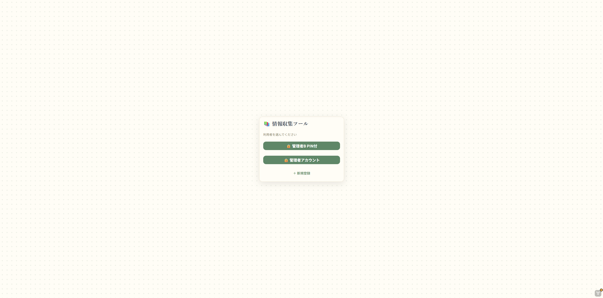
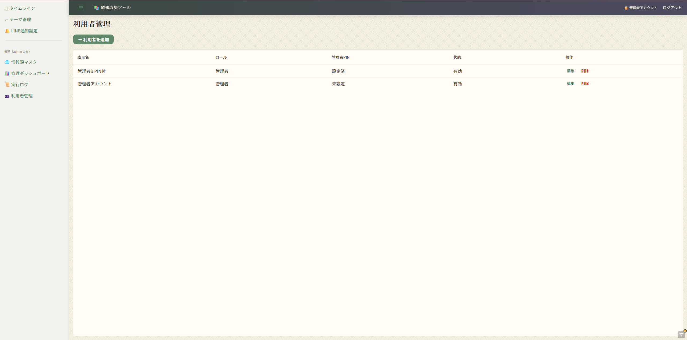

# 情報収集ツール

アニメ・漫画などのテーマ（作品名・キーワード）を登録すると、複数の情報源から関連する最新情報（グッズ／イベント／放送／コラボ等）を自動収集し、発生日順の一覧で確認できる Web アプリケーションです。お気に入り登録したテーマに新着があれば LINE で通知します。

**個人開発**（利用者2名想定）。Java / Spring Boot の学習を兼ねた、設計工程からの一貫開発を目的としています。

---

## 画面

### タイムライン（SC-02）

登録テーマにマッチした記事を発生日順に表示します。並び順（掲載日／発売日／収集日）・テーマ・情報源・カテゴリ・未読での絞り込み、タイトルと要約の全文検索（pg_trgm）に対応。**記事本文と公式画像は保存・表示せず、自作の要約と元記事リンクのみ**を扱います。



### 管理ダッシュボード（SC-07・admin 限定）

バッチの手動実行、RSS 取得の疎通テスト、**LINE 通数と LLM コストの消化状況**（当月・上限に対する残量）を1画面で確認できます。



### その他の画面

| | |
|---|---|
| **テーマ管理（SC-04）**<br>収集対象キーワードとカテゴリの登録<br> | **LINE通知設定（SC-05）**<br>友だち追加＋合言葉による連携／お気に入り<br> |
| **情報源マスタ（SC-06）**<br>**規約確認済のものだけを収集対象にする規約ゲート**<br> | **実行ログ（SC-08）**<br>収集ログ・通知ログ（送信結果と消費通数）<br> |
| **ログイン（SC-01）**<br>利用者選択式。管理者はPIN照合<br> | **利用者管理（SC-09）**<br>ロールと管理者PINの設定<br> |

## このリポジトリの特徴

コードだけでなく、**要件定義から詳細設計までの成果物を全て含めています**。前職（会計 ERP パッケージ開発・4年）で身につけたウォーターフォールの設計書文化を、Java の技術スタックに持ち込んだものです。

- 設計書 **18本**（要件定義2／基本設計8／詳細設計8）を Markdown で作成
- 要件ID `FR-xx` → 画面ID `SC-xx` → テーブルID `TBL-xx` → 実装 を**トレース表で追跡可能**にしている
- 各設計書には閲覧用の HTML（同名 `.html`）を併産（Mermaid 図の描画・目次サイドバー付き）

## 技術構成

| 層 | 採用技術 |
|---|---|
| 言語 | Java 21 |
| 基盤 | Spring Boot 3.3 |
| Web UI | Vaadin Flow 24.5（サーバーサイド Java でのステートフル UI） |
| データアクセス | Spring Data JPA / Hibernate |
| DB | PostgreSQL 16（Docker Compose） |
| マイグレーション | Flyway（SQL ベース） |
| ビルド | Maven マルチモジュール |
| RSS 解析 | ROME |
| HTML 本文抽出 | jsoup |
| robots.txt 判定 | crawler-commons |
| リトライ制御 | Resilience4j |
| LLM | Claude API（Anthropic 公式 Java SDK） |
| 通知 | LINE Messaging API（line-bot-sdk-java） |
| テスト | JUnit 5 / Mockito |

## モジュール構成

外部依存の向きを内側（ドメイン）に流さないよう、4モジュールに分割しています。

```
04_Code/
├─ aggregator-domain/          エンティティ・enum・ドメインルール（フレームワーク非依存）
├─ aggregator-infrastructure/  JPA・Flyway・外部API アダプタ・アプリケーションサービス
├─ aggregator-web/             Vaadin Flow による画面（10画面）
└─ aggregator-batch/           収集／通知バッチ（Web とは別プロセスの実行可能 jar）
```

**Web とバッチを別プロセスにしている理由**: バッチは「起動して処理して終了」する性質のため、常駐する Web と混ぜると障害の巻き込みとスケジューリングの複雑化を招きます。分離しておくことで、タスクスケジューラ／cron からバッチだけを起動でき、実行環境が変わっても同じ構造で動きます。

## 設計上、特に意識した点

- **LLM コストの上限**: Claude API の利用箇所を収集時の構造化に限定し、月次予算に達したら自動で停止します（利用者数に比例して増えない構造）。
- **障害分離**: 1つの情報源の取得失敗が、他の情報源の処理を止めません。
- **秘密情報**: 接続文字列・APIキー・LINEトークンはソースに書かず、環境変数から注入します（`application.yml` はプレースホルダのみ）。

## 開発工程と成果物

| 工程 | 主な成果物 |
|---|---|
| [01_Requirements](01_Requirements/) | [要件定義書](01_Requirements/要件定義書.md)／[未決事項回答ログ](01_Requirements/未決事項回答ログ.md) |
| [02_BasicDesign](02_BasicDesign/) | [画面設計書](02_BasicDesign/画面設計書.md)／[ER図](02_BasicDesign/ER図.md)／[テーブル定義書](02_BasicDesign/テーブル定義書.md)／[バッチ設計書](02_BasicDesign/バッチ設計書.md)／[外部IF設計書](02_BasicDesign/外部IF設計書.md)／[画面遷移図](02_BasicDesign/画面遷移図.md)／[メッセージ・エラー一覧](02_BasicDesign/メッセージ・エラー一覧.md)／[要件トレース表](02_BasicDesign/要件トレース表.md) |
| [03_DetailedDesign](03_DetailedDesign/) | [アーキテクチャ設計書](03_DetailedDesign/アーキテクチャ設計書.md)／[クラス設計書](03_DetailedDesign/クラス設計書.md)／[シーケンス設計書](03_DetailedDesign/シーケンス設計書.md)／[データアクセス設計書](03_DetailedDesign/データアクセス設計書.md)／[DI設計書](03_DetailedDesign/DI設計書.md)／[例外・リトライ設計書](03_DetailedDesign/例外・リトライ設計書.md)／[設定・秘密情報設計書](03_DetailedDesign/設定・秘密情報設計書.md)／[設計トレース表](03_DetailedDesign/設計トレース表.md) |
| [04_Code](04_Code/) | 実装（[セットアップ手順](04_Code/README.md)） |
| [05_UnitTest](05_UnitTest/) | 単体テスト |

## 規模

- 画面 10本 ／ テーブル 14本
- Java 130ファイル（約 8,700行）／ テストクラス 22本

## 進捗

段階的に機能を積み上げる方針で、Phase 5 までを実装済みです。

| Phase | 内容 | 状況 |
|---|---|---|
| 0 | DB 起動・Flyway マイグレーション | 完了 |
| 1 | テーマ登録・RSS 収集・一覧表示 | 完了 |
| 2 | LLM による構造化・重複排除・情報源追加 | 完了 |
| 3 | お気に入り・未読管理・フィルタ・全文検索 | 完了 |
| 4 | LINE 通知・冪等性の担保 | 完了 |
| 5 | 自動実行・管理画面・実行ログ | 完了 |
| 6 | インターネット公開・時刻ベース通知・死活監視 | 未着手 |

現時点ではローカル環境（Windows）での運用のみで、公開 URL はありません。

## セットアップ

```bash
cd 04_Code
cp .env.example .env      # 必要に応じて編集
docker compose up -d      # PostgreSQL を起動
./mvnw -DskipTests install
./mvnw -pl aggregator-web spring-boot:run
```

詳細は [04_Code/README.md](04_Code/README.md) を参照してください。

## ライセンス

[MIT License](LICENSE)（著作権表示を残せば、使用・改変・再配布は自由です）。

なお本アプリが収集する記事そのものの権利は各配信元に帰属します。本リポジトリのライセンスは、あくまでこのソフトウェアと設計書に対するものです。

## 開発の進め方について

本リポジトリでは Claude Code を用いた AI 支援開発を行っています。要件定義・設計判断・レビューは開発者本人が行い、その判断内容を [CLAUDE.md](CLAUDE.md) に設計制約として明文化したうえで実装を進めました。コミット履歴に AI が関与したものが含まれるのは、この進め方によるものです。
